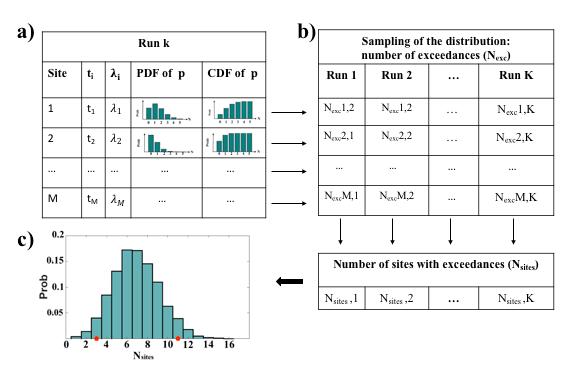
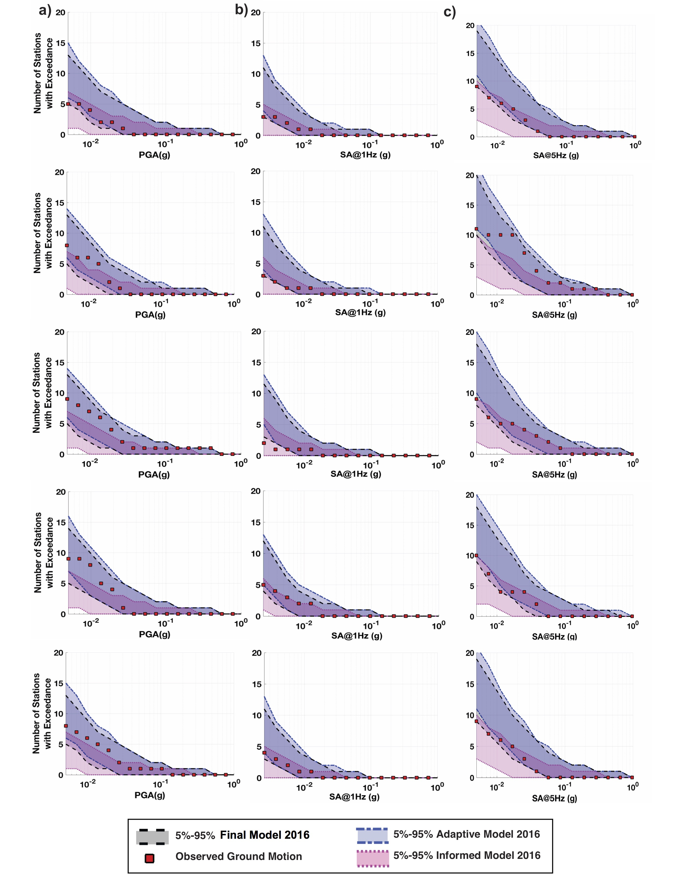
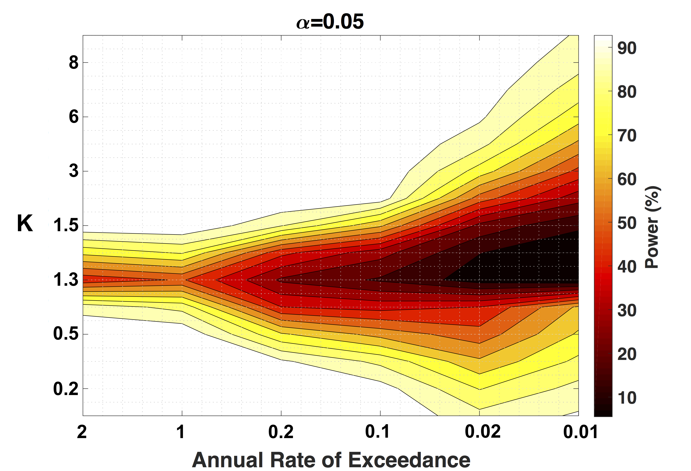

# Testing probablistic seismic hazard models
=====================================================================================

Codes for testing probablistic seismic hazard models as published in: 

"Mousavi, S. M., and G. C. Beroza, (2018). Evaluating the 2016-One-Year Seismic Hazard Model for the
Central and Eastern United States Using Instrumental Ground Motion Data, Seismological Research Letters"

## Ppaer
(https://www.researchgate.net/publication/323328230_Evaluating_the_2016_One-Year_Seismic_Hazard_Model_for_the_Central_and_Eastern_United_States_Using_Instrumental_Ground-Motion_Data)

## Abstract
Hazard curves in probabilistic seismic hazard assessment (PSHA) models are used to quantify seismic hazard by providing the annual rates of exceedance, the reciprocal of the return period, as a function of ground-motion levels. Beginning in 2016, the U.S. Geological Survey (USGS) started to produce one-year PSHA models for the central and eastern United States (CEUS) to account for the elevated seismicity in this region due to the wastewater injection. These models have much shorter return periods (99.5 years) compared to previous models (e.g., 2475 years for the 2014 model) and consider recent levels of induced seismicity in their construction. The nonstationarity in the level and location of wastewater injection, however, should lead to a change in the rate of induced seismicity, which makes any time-independent forecast challenging. We assess the 2016 seismic hazard model by comparing the model forecast with the observed ground motions during a one-year period. For this test, we use more than 18,000 instrumental strong-motion records observed during 2016 by 189 stations in the CEUS. We test the full model by considering the hazard curves in peak acceleration and spectral response acceleration for 1 and 5 Hz over the entire CEUS. Our results indicate that the observed hazard is generally consistent with that forecast by the model for peak ground acceleration (PGA) and 1 Hz (except at 5%g) and 5 Hz spectral accelerations. Although we find that the hazard model is consistent with observed ground motions, this does not necessarily validate the theories and assumptions used in the model development. Our results show that for mapped hazard level (1% probability of exceedance in one year) and using only one year of observation, the power of a statistical test will not be very high unless the actual hazard is grossly larger (> 6 times) or smaller (< 40%) than the forecast hazard. In other words, the data are still unlikely to reveal the inconsistency between the observed and forecasted hazards for one-year models with high confidence, due to the low amount of data at CEUS.

## Data

Monte Carlo sampling method for estimating Possonian probabilities associated with our Bernoli variables

## Results

## Statistical power of the test

